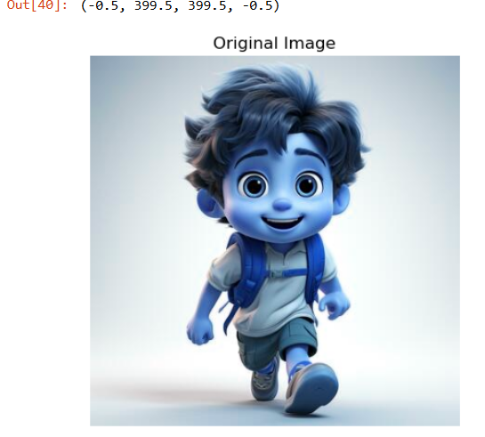
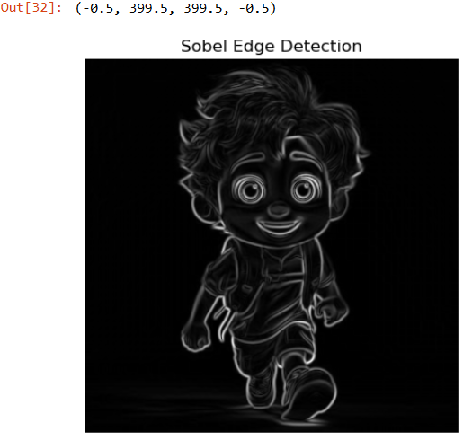
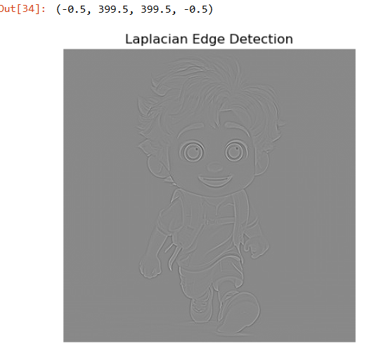
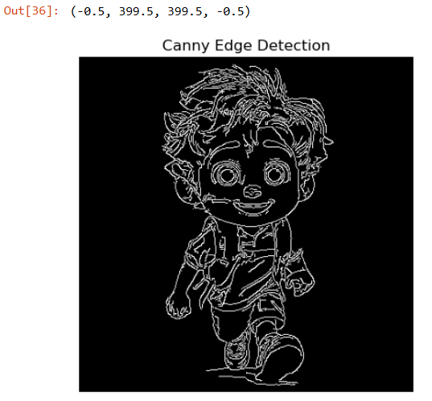

# EX-06: EDGE-DETECTION
## Aim:
To perform edge detection using Sobel, Laplacian, and Canny edge detectors.

## Software Required:
Anaconda - Python 3.7

## Algorithm:
### Step1:
Import all the necessary modules for the program.

### Step2:
Load a image using imread() from cv2 module.

### Step3:
Convert the image to grayscale

### Step4:
Using Sobel operator from cv2,detect the edges of the image.

### Step5:

Using Laplacian operator from cv2,detect the edges of the image and Using Canny operator from cv2,detect the edges of the image.

## Output:
```
Developed By: Ashwin Akash M
Reference Number: 212223230024
```
```
import cv2
import numpy as np
import matplotlib.pyplot as plt
image = cv2.imread('ex-06.1.jpg')
gray_image = cv2.cvtColor(image, cv2.COLOR_BGR2GRAY)
plt.imshow(image,cmap="gray")
plt.title('Original Image')
plt.axis("off")
```

### SOBEL EDGE DETECTOR
```
sobel_x = cv2.Sobel(gray_image, cv2.CV_64F, 1, 0, ksize=5)  
sobel_y = cv2.Sobel(gray_image, cv2.CV_64F, 0, 1, ksize=5)  
sobel_combined = cv2.magnitude(sobel_x, sobel_y) 
plt.imshow(sobel_combined, cmap='gray')
plt.title('Sobel Edge Detection')
plt.axis('off')
```

### LAPLACIAN EDGE DETECTOR
```
laplacian = cv2.Laplacian(gray_image, cv2.CV_64F)
plt.imshow(laplacian, cmap='gray')
plt.title('Laplacian Edge Detection')
plt.axis('off')
```

### CANNY EDGE DETECTOR
```
canny_edges = cv2.Canny(gray_image, 50, 150)
plt.imshow(canny_edges, cmap='gray')
plt.title('Canny Edge Detection')
plt.axis('off')
```


## Result:
Thus the edges are detected using Sobel, Laplacian, and Canny edge detectors.